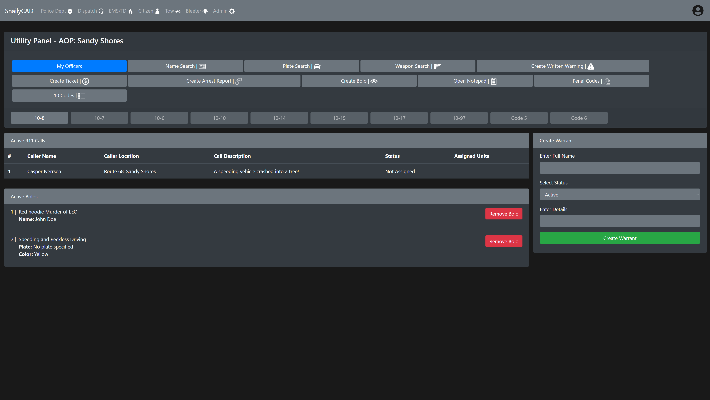
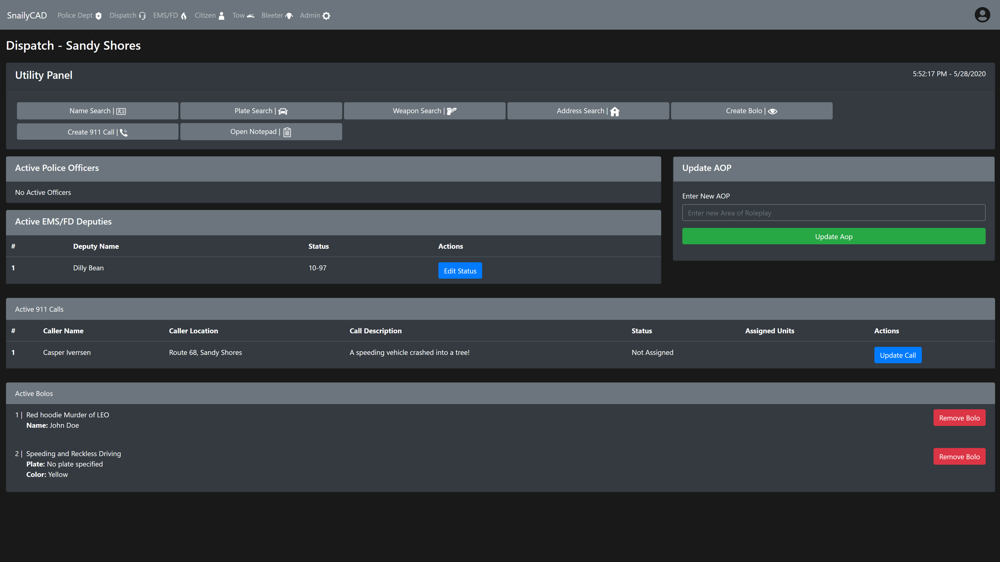
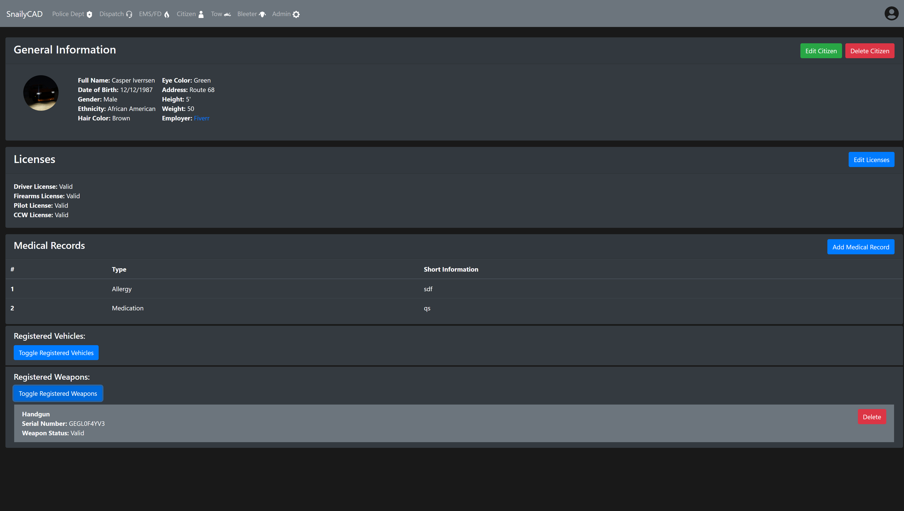

# SnailyCAD v2

SnailyCAD is a Free and secure NodeJS CAD/MDT for your community!

## Installation

1. Run `git clone https://github.com/Dev-CasperTheGhost/snaily-cadv2`
2. Run `npm install` to install the first part of the dependencies
3. Run `cd server && npm install` to install the second part of the dependencies
4. Run `cd ../` to go back
5. Run `cd client && npm install` to install the last dependencies (Might take a little bit)
6. Make a copy of `config-template.js` and rename the copy to `config.js`
7. Modify `config.js` where needed
8. Go to `client/src/config/` and modify `config.js` where needed
9. Create a new database, name it `snaily-cad`
10. Import `snaily-cad.sql` into that database, [Download xampp Here](https://www.apachefriends.org)
11. Run `npm start` in the root folder (`./snaily-cadv2`)

**If you don't understand any of these steps, let me know so I can help you.**

_If you find any problems with these steps, please contact me asap._

## Sneekpeaks

**Leo Dashboard**

**Dispatch Dashboard**

**Citizen Detail**

## Release Date

Full Release: Second Week Of June
